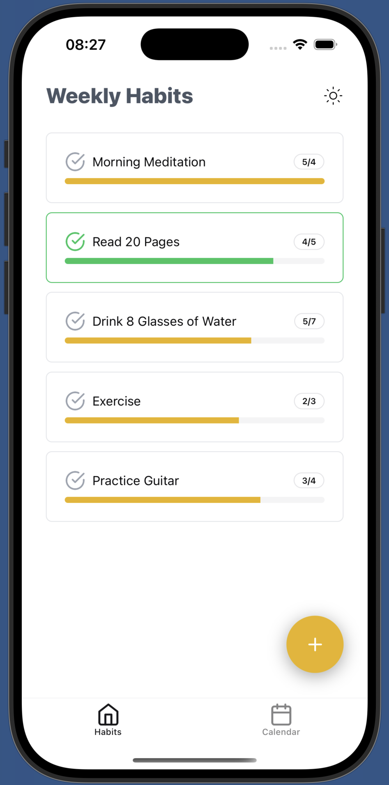
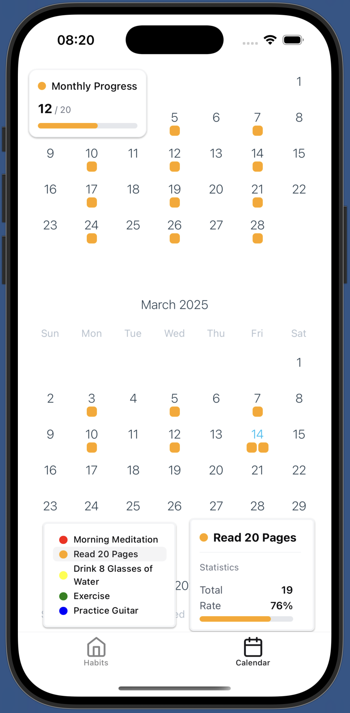
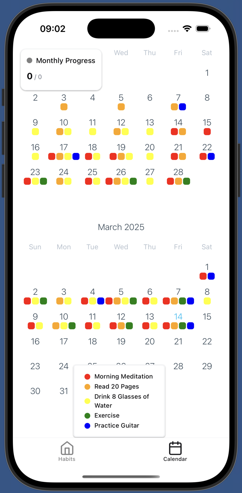

# Tiny Steps - Habit Tracker

Tiny Steps is a simple habit tracking app built with Expo. Inspired by _Atomic Habits_ by James Clear, it helps you build and maintain habits through small, consistent actions.

## Screenshots

  
  
  

## Features

- Track daily habits with ease
- Data stored locally on your device
- Notification support to keep you on track

## Picking a Habit

Choose a habit that’s easy to do—something so simple you can’t fail. If you miss a day, no problem, just don’t miss twice! Instead of aiming for a 10-mile run, start with “lace up your shoes and go outside.” Most times, you’ll end up running plenty anyway.

Start small, stay consistent, and watch your habits grow!

## Tech Stack

- Built with [**React Native Reusables**](https://rnr-docs.vercel.app/getting-started/introduction/) using reusable UI components. Their starter template was excellent.
- **Zustand** for lightweight and efficient state management
- **date-fns** for intuitive date manipulation
